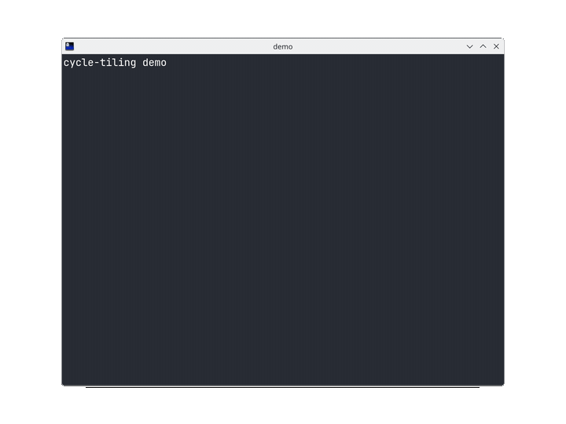

# Cycle Tiling

A window tiling utility for KDE Plasma 6 (Wayland and X11), implemented as a
KWin script.



## Shortcuts

| Shortcut | Action |
|---|---|
| `Ctrl+Shift+Super+Left` | Move the window to the left screen edge. Repeated presses cycle its width: **1/2 → 1/3 → 2/3 → 1/2 → ...** |
| `Ctrl+Shift+Super+Right` | Same for the right screen edge: **1/2 → 1/3 → 2/3 → 1/2 → ...** |
| `Ctrl+Shift+Super+Enter` | Center the window: **2/3 of the screen width**, **full height** |

Notes:

- The cycle step is derived from the window's actual geometry — no state is
  stored. If the window is already in one of the target positions, the next
  one is applied; otherwise the cycle starts at 1/2. This survives KWin
  restarts and works the same for any window.
- The window is laid out within the monitor it currently resides on (the
  work area is used, so panels are never overlapped).
- Maximized windows and windows attached to KWin tiles (quick/custom tiling)
  are automatically detached and given the new geometry.

## Installation

```bash
git clone <this repository>
cd kwin_window_cycle
./install.sh
```

This installs the package to `~/.local/share/kwin/scripts/cycleTiling/`,
enables it and activates it in the current session without re-login.

A note on KWin shortcuts: the built-in `Super+Left/Right` quick tiles
(half-screen tiling) are disabled by `install.sh` to avoid duplicating Cycle
Tiling. This is a file-level change to `~/.config/kglobalshortcutsrc` that
fully applies on the first re-login after installation. The
`Ctrl+Shift+Super+...` combinations are free by default and work right away.
User-customized bindings are never overwritten; quick tiling can be restored
in *System Settings → Shortcuts* or via `uninstall.sh`.

## Uninstallation

```bash
./uninstall.sh
```

## Rebinding shortcuts

*System Settings → Shortcuts*, search for "Cycle Tiling" — three entries
named like "Cycle Tiling: tile window to the left edge...". Changes apply
immediately.

## Configuration

In `src/contents/code/main.js`:

- `GAP` — gap between the window and the work-area edges, in pixels
  (default `0`);
- `FRACTIONS` — the set and order of cycle widths (default `[1/2, 1/3, 2/3]`);
- `TOLERANCE` — geometry comparison tolerance in pixels (needed because of
  fractional scaling and window size hints).

Re-run `./install.sh` after edits — it upgrades the installed package.

## Troubleshooting

The script logs to the journal:

```bash
journalctl --user -b --no-pager | grep cycleTiling
```

On load it prints `cycleTiling: loaded v1.1.0`. If the script is enabled but
the shortcuts do nothing, check that the combinations are not grabbed by
another application (*System Settings → Shortcuts*).

## Requirements

- KDE Plasma 6 (tested on Plasma 6.6, Wayland)
- `kpackagetool6`, `kwriteconfig6`, `qdbus6` (shipped with Plasma)

## License

MIT — see [LICENSE](LICENSE).
